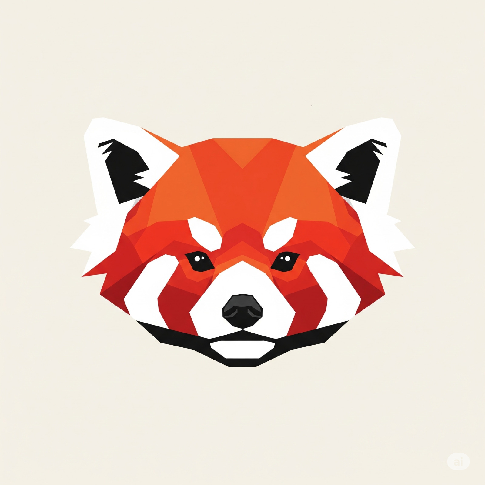

<h1 align="center">👋 ¡Hola! Soy Diego</h1>

  

---

## <picture></picture> Sobre Mi
<picture>
 
</picture>

- 🎓 Estudiante del UPTex, cursando la ingenieria en sistemas computacionales
- 💻 Entusiasta de las distribuciones linux, mi sistema actual basado en arch linux (EndevourOS)
- 🛠 Interesado en la automatizacion de servicios y scripting
- 🌐 Experiencia en JavaScript(expressjs), java(nativo), TypeScript(NestJS) y Golang(fiber)
- 📂 Competente en Git y GitHub para el control de versiones y la colaboracion
- 🗄 Experiencia con PostgreSQL, MySQL y SQLite
- 🌱 Actualmente aprendiendo Ingles para ampliar las oportunidades de comunicacion
- 😊 Siempre positivo, adaptable y comprometido con la mejora continua

---

##  Skills and Tools

### Lenguajes de Programacion
  
  
  
  

### Frameworks Backend
  
  
  
  

### Frameworks Frontend
  
  
  

### Control de Versiones y trabajo en equipo
  
  

### IDEs
  
  

### DevOps y Herramientas
  
  
  
  
  
  
### Bases de Datos
  
  
  
### Sistemas Operativos
  
  

---

## 📈 GitHub Stats

  
     
  

---

## 📫 Contacto

  

 
 &nbsp;
 
  &nbsp;
  

  

